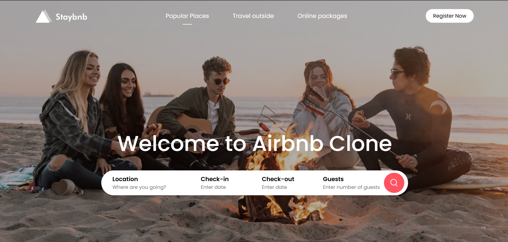
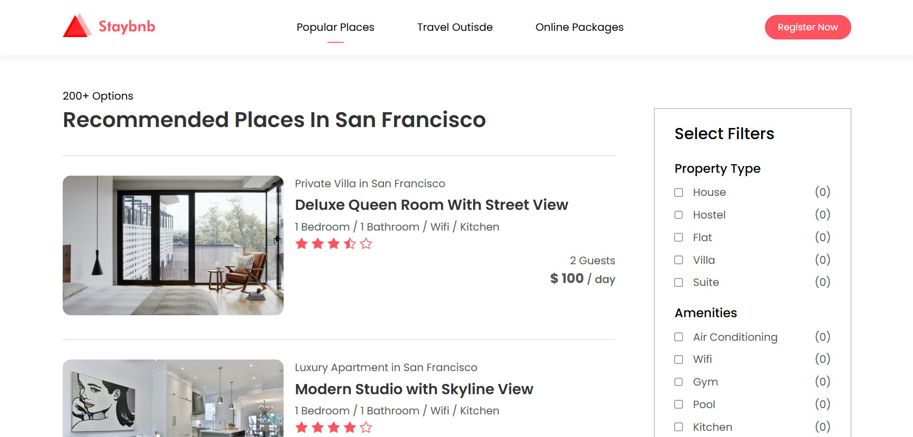
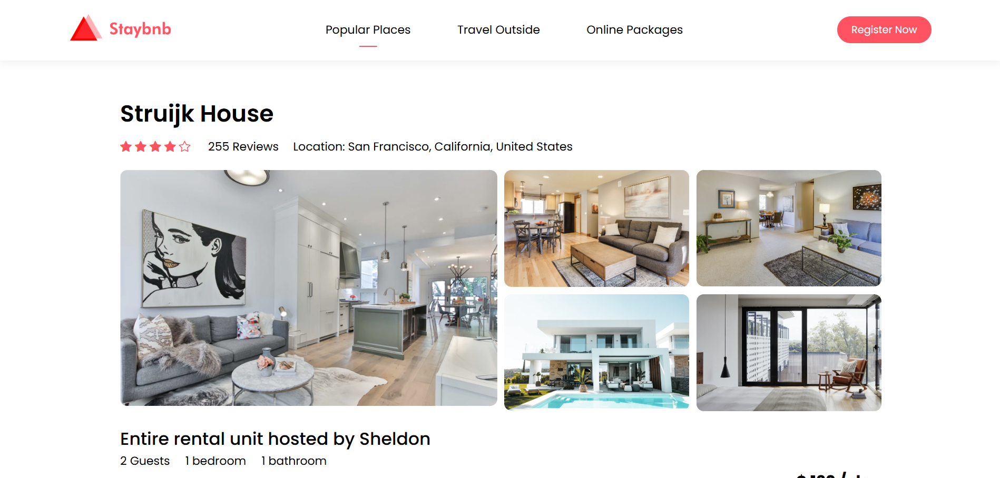

```markdown
# Staybnb - Airbnb Clone Project


A **responsive, static frontend clone** of Airbnb (rebranded as **Staybnb**) built using **HTML, CSS, and vanilla JavaScript**. This project demonstrates modern UI/UX design principles with a focus on clean layout, mobile responsiveness, and interactive elements.

---

## 🚀 Live Demo
> 

---

## 📁 Project Structure
```

```
staybnb-clone/
│
├── landingPage.html              # Landing / Home Page
├── detailedPage.html              # Property Details Page
├── listingPage.html            # Search Results / Listings Page
├── styles.css              # Global Styles & Responsiveness
├── images/                 # All assets (logos, banners, property images)
│   ├── logo.png
│   ├── logo-red.png
│   ├── banner.png
│   ├── house-1.png ... house-5.png
│   ├── image-1.png ... image-10.png
│   └── ...
└── README.md               # You're here!
```
```

---
---

## ✨ Features

| Feature | Description |
|--------|-------------|
| **Responsive Design** | Fully mobile-friendly with hamburger menu and fluid grids |
| **Interactive Navbar** | Toggle menu on mobile with smooth transitions |
| **Search Bar** | Styled input fields for location, dates, and guests |
| **Property Listings** | Grid-based exclusives, trending places, and detailed cards |
| **Property Detail Page** | Gallery, map, host info, booking form, reviews |
| **Filters Sidebar** | Property type & amenities (UI only) |
| **Pagination** | Mock pagination for listing results |
| **Google Maps Embed** | Real location map in property details |
| **Call-to-Action Sections** | "Sharing is Earning", Traveler Stories, etc. |
| **Social Media Footer** | Links to Facebook, YouTube, Twitter, LinkedIn, Instagram |

---
---

## 🛠️ Tech Stack

- **HTML5** – Semantic structure
- **CSS3** – Flexbox, Grid, Media Queries, Custom Properties
- **JavaScript (Vanilla)** – Mobile menu toggle
- **Google Fonts** – [Poppins](https://fonts.google.com/specimen/Poppins)
- **Bootstrap Icons** – Lightweight SVG icons
- **Google Maps Embed API** – Location visualization

---

## 🎨 Design Highlights

- **Color Scheme**: `#ff5361` (coral red), white, dark text
- **Typography**: Clean, modern `Poppins` font
- **Responsive Breakpoints**:
  - `1024px` – Tablet adjustments
  - `768px` – Mobile layout
  - `400px` – Small phones
- **Grid Layouts** for exclusives, trending, and image galleries
- **Smooth hover effects** on buttons and links

---

## 🚀 How to Run Locally

1. **Clone the repository**
   ```bash
   git clone https://github.com/yourusername/staybnb-clone.git
   cd staybnb-clone
   ```

2. **Open in browser**
   ```bash
   open landingPage.html
   ```
   Or just double-click `landingPage.html`

> No build tools or server required!

---

## 📱 Pages Overview

### 1. `landingPage.html` – **Home Page**
- Hero banner with search bar
- Exclusives, Trending, CTA, Stories
- About section and footer

### 2. `listingPage.html` – **Search Results**
- List of properties in San Francisco
- Filter sidebar (static)
- Pagination controls

### 3. `detailedPage.html` – **Property Details**
- Image gallery (grid layout)
- Booking form
- Host profile
- Google Maps
- Amenities & description

---

## 🔧 JavaScript Functionality

```js
function togglebtn() {
  document.getElementById("navBar").classList.toggle("hidemenu");
}
```
- Toggles mobile navigation menu
- Smooth transition via CSS

---

## 🎯 Future Enhancements (Optional)

- [ ] Connect to a real backend (Node.js + Express)
- [ ] Add dynamic search & filtering
- [ ] User authentication
- [ ] Booking system with calendar
- [ ] Reviews & ratings submission
- [ ] Dark mode toggle

---

## 🖼️ Screenshots

| Home | Listings | Details |
|------|----------|---------|
|  |  |  |

---

## 👨‍💻 Author

**Your Name**  
- GitHub: [@JoyelV](https://github.com/JoyelV)  
- LinkedIn: [JoyelV](https://www.linkedin.com/in/joyel-varghese-8a47501aa/)

---

## 📄 License

This project is open-source and available under the [MIT License](LICENSE).

---

## ⭐ Show Your Support

Give a ⭐ if you liked this project!  
Fork it, improve it, and make it your own.

---
**Built with ❤️ using only HTML, CSS & JS**
```